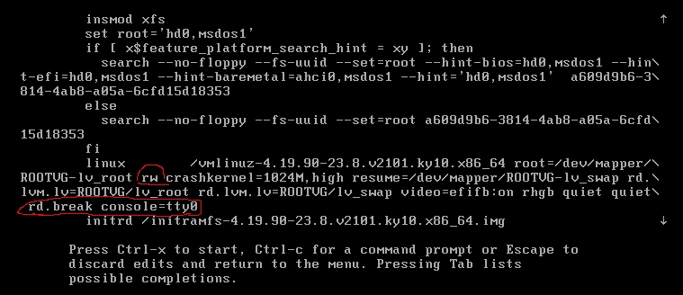
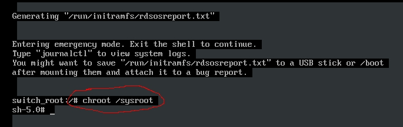

# Kylin

## 查看版本

```sh
nkvers
cat /etc/.productinfo
```

## 常见问题

```sh
# yum 源报 ssl 证书错误
sslverify = 0

# 同步源
# 先将 yum repo 指向特定版本和架构的源，然后执行以下语句同步
reposync -n --norepopath --repoid=ks10-adv-updates --arch=x86_64 -p /opt/mirror/os/kylin/v10sp2/updates/x86_64
reposync -n --norepopath --repoid=ks10-adv-updates --arch=x86_64 -p /opt/mirror/os/kylin/v10sp1/updates/x86_64
reposync -n --norepopath --repoid=ks10-adv-updates --arch=aarch64 -p /opt/mirror/os/kylin/v10sp2/updates/aarch64
reposync -n --norepopath --repoid=ks10-adv-updates --arch=aarch64 -p /opt/mirror/os/kylin/v10sp1/updates/aarch64

reposync -n --norepopath --repoid=ks7-adv-updates --arch=x86_64 -p /opt/mirror/os/kylin/v7/updates/x86_64
reposync -n --norepopath --repoid=ks7-adv-updates --arch=aarch64 -p /opt/mirror/os/kylin/v7/updates/aarch64
```

## 配置网络

```sh
# 配置 IP
[root@test ~]# cat /etc/sysconfig/network-scripts/ifcfg-ens33
TYPE=Ethernet
PROXY_METHOD=none
BROWSER_ONLY=no
#BOOTPROTO=dhcp
DEFROUTE=yes
IPV4_FAILURE_FATAL=no
IPV6INIT=yes
IPV6_AUTOCONF=yes
IPV6_DEFROUTE=yes
IPV6_FAILURE_FATAL=no
IPV6_ADDR_GEN_MODE=stable-privacy
NAME=ens33
UUID=c67c9f61-64d2-44ad-999a-80b9f260a775
DEVICE=ens33
#ONBOOT=no

ONBOOT=yes
BOOTPROTO=static
IPADDR=172.16.230.199
NETMASK=255.255.255.0
GATEWAY=172.16.230.2
DNS1=223.5.5.5
DNS2=114.114.114.114

# 重启网卡
ifdown ens33
ifup ens33

# nmcli 重新加载网卡配置文件
nmcli connection load /etc/sysconfig/network-scripts/ifcfg-ens33
nmcli connection up ens33

# 或者重新加载所有网卡配置文件
nmcli connection reload
nmcli connection up ens33
```

## 修改字符集

```sh
# 查看当前字符集
locale

# 使用 localectl 命令修改
sudo localectl set-locale LANG=en_US.UTF-8

# 或者直接修改配置文件
[root@test ~]# vim /etc/locale.conf
LANG=en_US.UTF-8
```

## 修改时区

```sh
# 查看所有可用时区
sudo timedatectl list-timezones

# 设置为东八区
sudo timedatectl set-timezone Asia/Shanghai
```

## 时间服务

```sh
# 配置时间服务
$ sudo vim /etc/chrony.conf
server ntp.aliyun.com iburst

# 重启服务并设置为自启动
sudo systemctl restart chronyd
sudo systemctl enable chronyd

# 查看时间是否同步成功，IP 前面带 * 号表示同步成功
[root@test ~]# chronyc sources -v
210 Number of sources = 1

  .-- Source mode  '^' = server, '=' = peer, '#' = local clock.
 / .- Source state '*' = current synced, '+' = combined , '-' = not combined,
| /   '?' = unreachable, 'x' = time may be in error, '~' = time too variable.
||                                                 .- xxxx [ yyyy ] +/- zzzz
||      Reachability register (octal) -.           |  xxxx = adjusted offset,
||      Log2(Polling interval) --.      |          |  yyyy = measured offset,
||                                \     |          |  zzzz = estimated error.
||                                 |    |           \
MS Name/IP address         Stratum Poll Reach LastRx Last sample               
===============================================================================
^* 203.107.6.88                  2   6   177    30  -2223us[-5612us] +/-   34ms

# 手工同步
chronyc makestep
```

## 单用户模式

开机后，Grub 界面选择对应 Kernel，按 e 进入编辑模式

光标向下移动至 `linux` 开头的行，修改 `ro` 为 `rw`，末尾添加 `rd.break console=tty0`，按 `Ctrl X` 或 `F10` 保存继续



输入 `chroot /sysroot` 切换至主机系统



## Links

- [Kylinv10使用笔记](https://www.cnblogs.com/Leonardo-li/category/2250745.html)
- [银河麒麟高级服务器操作系统V10(sp1)安装手册](https://www.kancloud.cn/desktop/lv200/2659715)
